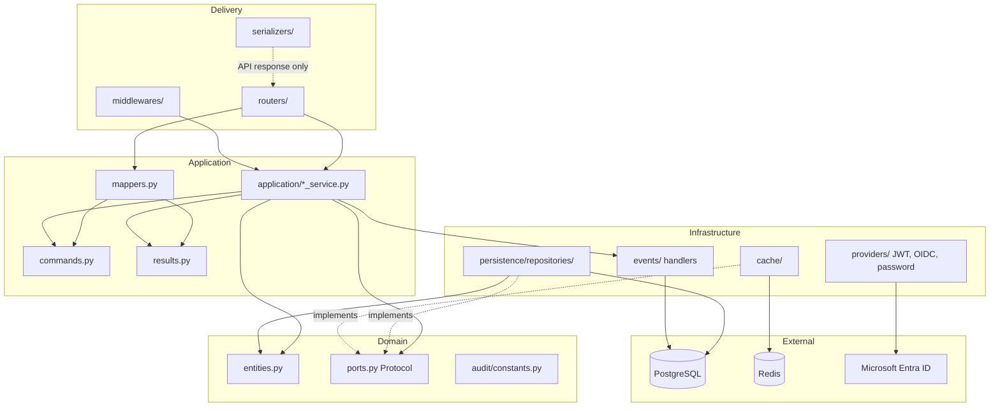
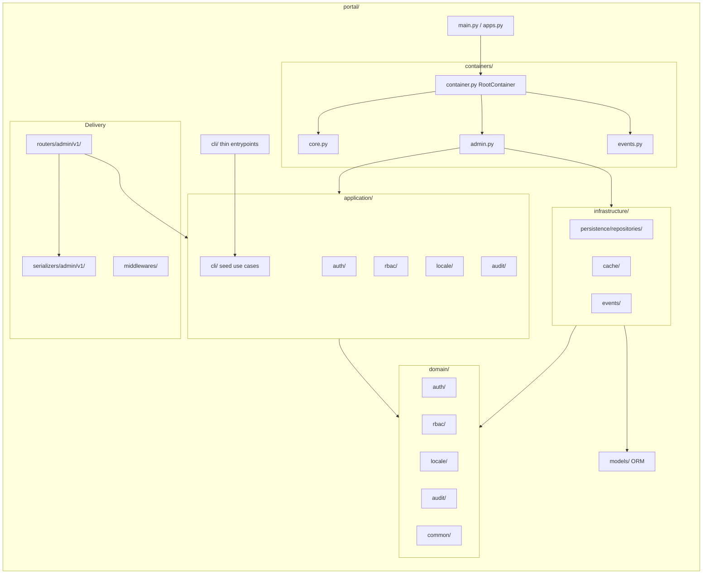
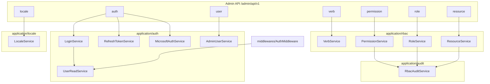
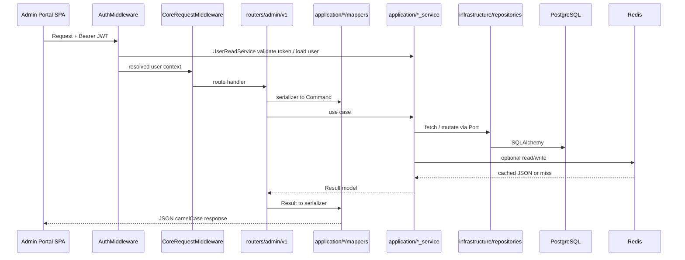
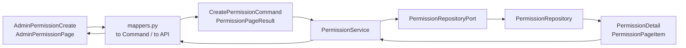

# NewLife Core API Portal

NewLife Core API Portal is a portal for the NewLife Core infrastructure. It is a FastAPI application with core infrastructure: database (PostgreSQL + async SQLAlchemy), Redis, JWT auth, RBAC, event bus, and more. Copy and customize for new projects.

## Architecture

The codebase follows **Clean Architecture**: dependencies point inward. Outer layers (HTTP, persistence) depend on inner abstractions (domain ports, application use cases), not the other way around.

### Layer dependency



| Layer | Path | Responsibility |
|-------|------|----------------|
| Domain | `portal/domain/` | Pydantic entities, repository/cache **ports** (Protocol), audit table constants |
| Application | `portal/application/` | Use-case **services**, **commands** / **results** (snake_case Pydantic); **mappers** translate to serializers at the boundary |
| Infrastructure | `portal/infrastructure/` | SQLAlchemy **repositories**, Redis **caches**, **event handlers** |
| Delivery | `portal/routers/`, `portal/serializers/`, `portal/middlewares/` | HTTP routes, API contracts (camelCase), auth and request context |
| Cross-cutting | `portal/providers/`, `portal/events/`, `portal/libs/` | JWT/OIDC/password, event bus, DB session, authorization helpers |
| DI | `portal/containers/` | `core`, `admin`, `events`; composition root at `portal/container.py` |
| Legacy re-export | `portal/schemas/` | Backward-compatible aliases to `domain/` / `application/` types |

### Repository layout



### Bounded contexts and services



### Dependency injection

```mermaid
flowchart TB
    Root[RootContainer portal/container.py]

    subgraph CoreContainer [CoreContainer]
        PGConn[PostgresConnection]
        Session[Session / SessionProxy]
        RedisPool[RedisPool]
        JWT[JWTProvider]
        Password[PasswordProvider]
        Refresh[RefreshTokenProvider]
        OIDC[MicrosoftOidcProvider]
        Blacklist[TokenBlacklistProvider]
    end

    subgraph AdminContainer [AdminContainer]
        UR[UserRepository]
        URS[UserReadService]
        LR[LocaleRepository]
        LC[LocaleCache]
        LS[LocaleService]
        PR[PermissionRepository]
        PC[PermissionCache]
        PS[PermissionService]
        RR[RoleRepository]
        RC[RoleCache]
        RS[RoleService]
        ResR[ResourceRepository]
        ResS[ResourceService]
        VR[VerbRepository]
        VC[VerbListCache]
        VS[VerbService]
        Audit[RbacAuditService]
        PermCheck[PermissionChecker]
    end

    subgraph EventsContainer [EventsContainer]
        Bus[EventBus]
        LogHandler[AdminOperationLogEventHandler]
    end

    Root --> CoreContainer
    Root --> AdminContainer
    Root --> EventsContainer
    AdminContainer -->|core.*| CoreContainer
    EventsContainer -->|core.request_session| CoreContainer

    UR --> Session
    PR --> Session
    RR --> Session
    ResR --> Session
    VR --> Session
    LR --> Session
    LC --> RedisPool
    PC --> RedisPool
    RC --> RedisPool
    VC --> RedisPool
```



### HTTP request flow (admin, authenticated)



### Vertical slice (example: Permission)

A full feature follows the same pattern as **Verb** and **Permission**:



**Adding a feature:** define entity + port in `domain/`, implement repository in `infrastructure/`, add commands/results + service in `application/`, wire providers in `containers/admin.py`, expose via router + `mappers.py` + `serializers/`.

## 🛠️ Tech Stack

- **Backend Framework**: FastAPI
- **Database**: PostgreSQL (using SQLAlchemy + asyncpg)
- **Cache**: Redis
- **Authentication**: JWT
- **Authorization**: RBAC (Role-Based Access Control)
- **Containerization**: Docker
- **Package Manager**: Poetry
- **Database Migration**: Alembic
- **Python Version**: 3.13+

## Prerequisites

- Python 3.13+
- PostgreSQL 17
- Redis 7
- Docker

## Quick Start setup environment

> All setup commands should be run in the root directory of the project.

### 1. Install Poetry

[Poetry Installation Guide](https://python-poetry.org/docs/#system-requirements)

### 2. Install pyenv (Recommended | Optional)

[pyenv Installation Guide](https://github.com/pyenv/pyenv#installation)

#### Install Python 3.13

```bash
pyenv install 3.13.x  # Replace x with the version you want to install
pyenv local 3.13.x   # Replace x with the version you installed
```

### 3. Install Dependencies

#### Using pyenv

```bash
pyenv local 3.13.x   # Replace x with the version you installed
poetry env use 3.13.x # Replace x with the version you installed
poetry install
```

#### Without pyenv

```bash
poetry install
```

### 4. Environment Setup

Create a `.env` file in the project root:

```bash
cp example.env .env
```

> Edit `.env` file to set up your local environment variables.

#### Microsoft Entra ID (Admin Portal sign-in)

The Admin Portal SPA can sign in with Microsoft and exchange the Entra **ID token** for portal JWTs at `POST /admin/api/v1/auth/microsoft`.

1. In [Microsoft Entra admin center](https://entra.microsoft.com/), register a **Single-page application** (redirect URI = your portal origin, e.g. `http://localhost:5173`).
2. Enable the **Authorization Code** flow with **PKCE**; under **Token configuration**, ensure the ID token can emit **email** (and optionally **preferred_username** / **oid**).
3. Set the same application (client) ID on the API and the SPA:
   - API: `AZURE_TENANT_ID`, `AZURE_SPA_CLIENT_ID` in `.env` (see `example.env`).
   - Admin Portal: `VITE_AZURE_CLIENT_ID`, `VITE_AZURE_TENANT_ID`, and optional `VITE_AZURE_REDIRECT_URI` (see `newlife-portal-frontend/.env.example`).
4. Ensure `CORS_ALLOWED_ORIGINS` includes the Admin Portal origin.
5. The portal user must already exist with `is_admin`, `is_active`, and `verified`; matching is by **email** from the token.

### 5. docker

Make sure you have Docker installed and running.

> start up local redis and postgresql server with `docker-compose.yml`

```shell
docker compose up -d
```

### 5. Database Setup

> How to use Alembic to manage database migrations.
> 
> Refer to [Alembic documentation](http://alembic.sqlalchemy.org/en/latest/tutorial.html)

#### About Branch

> The concept is similar to a branch in git.
> 
> It allows you to create a new version of the database schema without affecting the current version.

[Alembic Branching](https://alembic.sqlalchemy.org/en/latest/branches.html)

#### Init Migration

> Refer to [Alembic(First Migration)](https://alembic.sqlalchemy.org/en/latest/tutorial.html#running-our-first-migration)

```shell
poetry run alembic upgrade head
```

#### Create Migration

```shell
poetry run alembic revision --autogenerate -m "{your message}"
```

#### Upgrade Migration

> Refer to [Alembic(Partial Revision Identifiers)](https://alembic.sqlalchemy.org/en/latest/tutorial.html#partial-revision-identifiers)

```shell
poetry run alembic upgrade {revision}
```

#### Downgrade Migration

> Refer to [Alembic(Relative Migration Identifiers)](https://alembic.sqlalchemy.org/en/latest/tutorial.html#relative-migration-identifiers)

```shell
poetry run alembic downgrade -1
```
or
```shell
poetry run alembic downgrade {revision}
```

#### Get Current Version

> Refer to [Alembic(Getting Information)](https://alembic.sqlalchemy.org/en/latest/tutorial.html#getting-information)
```shell
poetry run alembic current
```

#### Show Migration History

> Refer to [Alembic(Viewing History Ranges)](https://alembic.sqlalchemy.org/en/latest/tutorial.html#viewing-history-ranges)

```shell
poetry run alembic history
```
or
```shell
poetry run alembic history --verbose
```

## Run FastAPI server

```shell
# development (with reload)
poetry run uvicorn portal.main:app --reload

# or
poetry run python -m portal
```

### Output example

```
INFO:     Uvicorn running on http://127.0.0.1:8000 (Press CTRL+C to quit)
INFO:     Started reloader process [68287] using StatReload
INFO:     Started server process [68289]
INFO:     Waiting for application startup.
INFO:     Application startup complete.
```

### API documentation

API documentation reference clicks [here](http://127.0.0.1:8000/docs)
