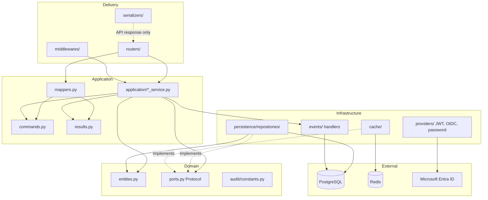
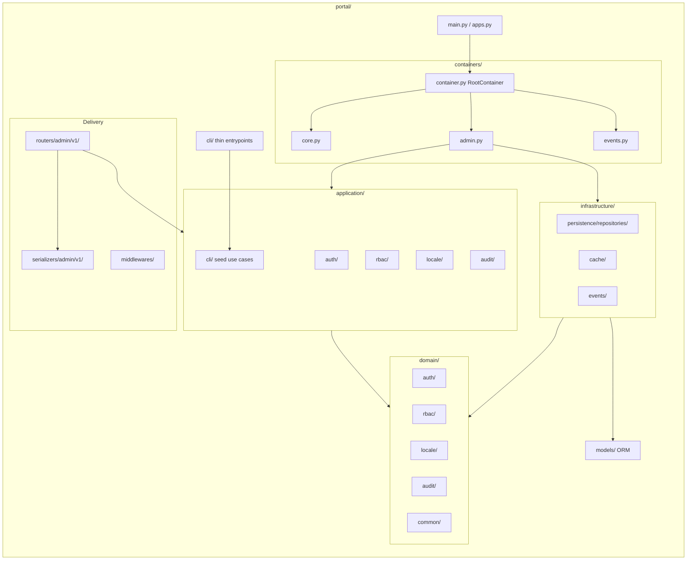
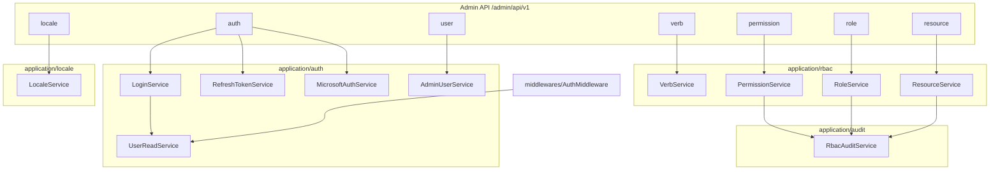
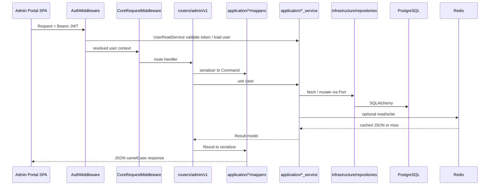
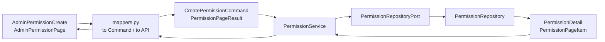

# NewLife Core API Portal

NewLife Core API Portal is a portal for the NewLife Core infrastructure. It is a FastAPI application with core infrastructure: database (PostgreSQL + async SQLAlchemy), Redis, JWT auth, RBAC, event bus, and more. Copy and customize for new projects.

## Architecture

The codebase follows **Clean Architecture**: dependencies point inward. Outer layers (HTTP, persistence) depend on inner abstractions (domain ports, application use cases), not the other way around.

### Layer dependency


```mermaid
flowchart TB
    subgraph delivery [Delivery]
        Routers["routers/"]
        Serializers["serializers/"]
        Middlewares["middlewares/"]
    end

    subgraph application [Application]
        Services["application/*_service.py"]
        Commands["commands.py"]
        Results["results.py"]
        Mappers["mappers.py"]
    end

    subgraph domain [Domain]
        Entities["entities.py"]
        Ports["ports.py Protocol"]
        AuditConst["audit/constants.py"]
    end

    subgraph infrastructure [Infrastructure]
        Repos["persistence/repositories/"]
        Cache["cache/"]
        EventHandlers["events/ handlers"]
        Providers["providers/ JWT, OIDC, password"]
    end

    subgraph external [External]
        PG[(PostgreSQL)]
        Redis[(Redis)]
        Entra[Microsoft Entra ID]
    end

    Routers --> Mappers
    Mappers --> Commands
    Mappers --> Results
    Routers --> Services
    Middlewares --> Services
    Services --> Commands
    Services --> Results
    Services --> Ports
    Services --> Entities
    Repos -.->|implements| Ports
    Cache -.->|implements| Ports
    Repos --> Entities
    Repos --> PG
    Cache --> Redis
    Providers --> Entra
    Services --> EventHandlers
    EventHandlers --> PG

    Serializers -.->|API response only| Routers
```

| Layer          | Path                                                            | Responsibility                                                                                                                |
| -------------- | --------------------------------------------------------------- | ----------------------------------------------------------------------------------------------------------------------------- |
| Domain         | `portal/domain/`                                                | Pydantic entities, repository/cache **ports** (Protocol), audit table constants                                               |
| Application    | `portal/application/`                                           | Use-case **services**, **commands** / **results** (snake_case Pydantic); **mappers** translate to serializers at the boundary |
| Infrastructure | `portal/infrastructure/`                                        | SQLAlchemy **repositories**, Redis **caches**, **event handlers**                                                             |
| Delivery       | `portal/routers/`, `portal/serializers/`, `portal/middlewares/` | HTTP routes, API contracts (camelCase), auth and request context                                                              |
| Cross-cutting  | `portal/providers/`, `portal/events/`, `portal/libs/`           | JWT/OIDC/password, event bus, DB session, authorization helpers                                                               |
| DI             | `portal/containers/`                                            | `core`, `admin`, `events`; composition root at `portal/container.py`                                                          |

### Repository layout


```mermaid
flowchart LR
    subgraph portal [portal/]
        main[main.py / apps.py]

        subgraph containers [containers/]
            root[container.py RootContainer]
            core[core.py]
            admin[admin.py]
            events[events.py]
        end

        subgraph domain_pkg [domain/]
            d_auth[auth/]
            d_rbac[rbac/]
            d_locale[locale/]
            d_audit[audit/]
            d_common[common/]
        end

        subgraph app_pkg [application/]
            a_auth[auth/]
            a_rbac[rbac/]
            a_locale[locale/]
            a_audit[audit/]
            a_cli[cli/ seed use cases]
        end

        subgraph infra_pkg [infrastructure/]
            i_repo[persistence/repositories/]
            i_cache[cache/]
            i_events[events/]
        end

        subgraph delivery_pkg [Delivery]
            routers[routers/admin/v1/]
            serializers[serializers/admin/v1/]
            mw[middlewares/]
        end

        models[models/ ORM]
        cli[cli/ thin entrypoints]
    end

    main --> root
    root --> core
    root --> admin
    root --> events
    admin --> app_pkg
    admin --> infra_pkg
    app_pkg --> domain_pkg
    infra_pkg --> domain_pkg
    infra_pkg --> models
    routers --> app_pkg
    routers --> serializers
    cli --> a_cli
```

### Bounded contexts and services


```mermaid
flowchart TB
    subgraph admin_api [Admin API /admin/api/v1]
        R_auth[auth]
        R_user[user]
        R_locale[locale]
        R_verb[verb]
        R_perm[permission]
        R_role[role]
        R_res[resource]
    end

    subgraph auth_ctx [application/auth]
        LoginService
        RefreshTokenService
        MicrosoftAuthService
        AdminUserService
        UserReadService
    end

    subgraph rbac_ctx [application/rbac]
        VerbService
        PermissionService
        RoleService
        ResourceService
    end

    subgraph locale_ctx [application/locale]
        LocaleService
    end

    subgraph audit_ctx [application/audit]
        RbacAuditService
    end

    R_auth --> LoginService
    R_auth --> RefreshTokenService
    R_auth --> MicrosoftAuthService
    R_user --> AdminUserService
    R_locale --> LocaleService
    R_verb --> VerbService
    R_perm --> PermissionService
    R_role --> RoleService
    R_res --> ResourceService

    PermissionService --> RbacAuditService
    RoleService --> RbacAuditService
    ResourceService --> RbacAuditService

    LoginService --> UserReadService
    AuthMiddleware[middlewares/AuthMiddleware] --> UserReadService
```

### Dependency injection


```mermaid
flowchart TB
    Root[RootContainer portal/container.py]

    subgraph CoreContainer [CoreContainer]
        PGConn[PostgresConnection]
        Session[Session / SessionProxy]
        RedisPool[RedisPool]
        JWT[JWTProvider]
        Password[PasswordProvider]
        Refresh[RefreshTokenProvider]
        OIDC[MicrosoftOidcProvider]
        Blacklist[TokenBlacklistProvider]
    end

    subgraph AdminContainer [AdminContainer]
        UR[UserRepository]
        URS[UserReadService]
        LR[LocaleRepository]
        LC[LocaleCache]
        LS[LocaleService]
        PR[PermissionRepository]
        PC[PermissionCache]
        PS[PermissionService]
        RR[RoleRepository]
        RC[RoleCache]
        RS[RoleService]
        ResR[ResourceRepository]
        ResS[ResourceService]
        VR[VerbRepository]
        VC[VerbListCache]
        VS[VerbService]
        Audit[RbacAuditService]
        PermCheck[PermissionChecker]
    end

    subgraph EventsContainer [EventsContainer]
        Bus[EventBus]
        LogHandler[AdminOperationLogEventHandler]
    end

    Root --> CoreContainer
    Root --> AdminContainer
    Root --> EventsContainer
    AdminContainer -->|core.*| CoreContainer
    EventsContainer -->|core.request_session| CoreContainer

    UR --> Session
    PR --> Session
    RR --> Session
    ResR --> Session
    VR --> Session
    LR --> Session
    LC --> RedisPool
    PC --> RedisPool
    RC --> RedisPool
    VC --> RedisPool
```

### HTTP request flow (admin, authenticated)


```mermaid
sequenceDiagram
    participant Client as Admin Portal SPA
    participant MW as AuthMiddleware
    participant CoreMW as CoreRequestMiddleware
    participant Router as routers/admin/v1
    participant Mapper as application/*/mappers
    participant Service as application/*_service
    participant Repo as infrastructure/repositories
    participant DB as PostgreSQL
    participant Cache as Redis

    Client->>MW: Request + Bearer JWT
    MW->>Service: UserReadService validate token / load user
    MW->>CoreMW: resolved user context
    CoreMW->>Router: route handler
    Router->>Mapper: serializer to Command
    Router->>Service: use case
    Service->>Repo: fetch / mutate via Port
    Repo->>DB: SQLAlchemy
    Service->>Cache: optional read/write
    Cache-->>Service: cached JSON or miss
    Service-->>Router: Result model
    Router->>Mapper: Result to serializer
    Mapper-->>Client: JSON camelCase response
```

### Vertical slice (example: Permission)

A full feature follows the same pattern as **Verb** and **Permission**:


```mermaid
flowchart LR
    API["AdminPermissionCreate<br/>AdminPermissionPage"]
    Mapper["mappers.py<br/>to Command / to API"]
    Cmd["CreatePermissionCommand<br/>PermissionPageResult"]
    Svc["PermissionService"]
    Port["PermissionRepositoryPort"]
    Repo["PermissionRepository"]
    Ent["PermissionDetail<br/>PermissionPageItem"]

    API --> Mapper
    Mapper --> Cmd
    Cmd --> Svc
    Svc --> Port
    Port --> Repo
    Repo --> Ent
    Ent --> Svc
    Svc --> Mapper
    Mapper --> API
```

**Adding a feature:** define entity + port in `domain/`, implement repository in `infrastructure/`, add commands/results + service in `application/`, wire providers in `containers/admin.py`, expose via router + `mappers.py` + `serializers/`.

## 🛠️ Tech Stack

- **Backend Framework**: FastAPI
- **Database**: PostgreSQL (using SQLAlchemy + asyncpg)
- **Cache**: Redis
- **Authentication**: JWT
- **Authorization**: RBAC (Role-Based Access Control)
- **Containerization**: Docker
- **Package Manager**: uv
- **Database Migration**: Alembic
- **Python Version**: 3.14+

## Prerequisites

- uv `>=0.12.4,<0.13` (see `[tool.uv] required-version`)
- PostgreSQL 17
- Redis 7
- Docker

## Quick Start setup environment

> All setup commands should be run in the root directory of the project.

### Install uv

[uv installation](https://docs.astral.sh/uv/getting-started/installation/)

uv reads `.python-version` (`3.14`) and installs that interpreter if it is missing.

### Install Dependencies

```bash
uv sync
```

### Git hooks (once per clone)

```bash
./scripts/install-git-hooks.sh
```

Branch names must follow `{type}/{issue-number}-{short-description}` (see `AGENTS.md`). PRs run `.github/workflows/branch-name.yml`.

### Environment Setup

Create a `.env` file in the project root:

```bash
cp example.env .env
```

> Edit `.env` file to set up your local environment variables.

#### Microsoft Entra ID (Admin Portal sign-in)

The Admin Portal SPA can sign in with Microsoft and exchange the Entra **ID token** for portal JWTs at `POST /admin/api/v1/auth/microsoft`.

1. In [Microsoft Entra admin center](https://entra.microsoft.com/), register a **Single-page application** (redirect URI = your portal origin, e.g. `http://localhost:5173`).
2. Enable the **Authorization Code** flow with **PKCE**; under **Token configuration**, ensure the ID token can emit **email** (and optionally **preferred_username** / **oid**).
3. Set the same application (client) ID on the API and the SPA:
   - API: `AZURE_TENANT_ID`, `AZURE_SPA_CLIENT_ID` in `.env` (see `example.env`).
   - Admin Portal: `VITE_AZURE_CLIENT_ID`, `VITE_AZURE_TENANT_ID`, and optional `VITE_AZURE_REDIRECT_URI` (see `newlife-portal-frontend/.env.example`).
4. Ensure `CORS_ALLOWED_ORIGINS` includes the Admin Portal origin.
5. The portal user must already exist with `is_admin`, `is_active`, and `verified`; matching is by **email** from the token.

### Docker

Make sure you have Docker installed and running.

> Start up local Redis and PostgreSQL with `docker-compose.yml`.

```shell
docker compose up -d
```

### Database Setup

> How to use Alembic to manage database migrations.
>
> Refer to [Alembic documentation](http://alembic.sqlalchemy.org/en/latest/tutorial.html)

#### About Branch

> The concept is similar to a branch in git.
>
> It allows you to create a new version of the database schema without affecting the current version.

[Alembic Branching](https://alembic.sqlalchemy.org/en/latest/branches.html)

#### Init Migration

> Refer to [Alembic(First Migration)](https://alembic.sqlalchemy.org/en/latest/tutorial.html#running-our-first-migration)

```shell
uv run alembic upgrade head
```

#### Create Migration

```shell
uv run alembic revision --autogenerate -m "{your message}"
```

#### Upgrade Migration

> Refer to [Alembic(Partial Revision Identifiers)](https://alembic.sqlalchemy.org/en/latest/tutorial.html#partial-revision-identifiers)

```shell
uv run alembic upgrade {revision}
```

#### Downgrade Migration

> Refer to [Alembic(Relative Migration Identifiers)](https://alembic.sqlalchemy.org/en/latest/tutorial.html#relative-migration-identifiers)

```shell
uv run alembic downgrade -1
```

or

```shell
uv run alembic downgrade {revision}
```

#### Get Current Version

> Refer to [Alembic(Getting Information)](https://alembic.sqlalchemy.org/en/latest/tutorial.html#getting-information)

```shell
uv run alembic current
```

#### Show Migration History

> Refer to [Alembic(Viewing History Ranges)](https://alembic.sqlalchemy.org/en/latest/tutorial.html#viewing-history-ranges)

```shell
uv run alembic history
```

or

```shell
uv run alembic history --verbose
```

### Project initialization (CLI)

After migrations, seed baseline data and create the first admin account. Run all commands from the project root:

```shell
uv run python -m portal.cli.main --help
```

#### Recommended order (fresh database)

Prerequisites: `.env` configured, Docker services running, and `alembic upgrade head` completed.

```shell
# 1. Supported locales (en, zh-TW, zh-CN)
uv run python -m portal.cli.main init-locales

# 2. RBAC catalog (verbs, resources, permissions, admin role)
uv run python -m portal.cli.main init-rbac

# 3. First portal admin (interactive prompts)
uv run python -m portal.cli.main create-superuser

# 4. Optional: org position seed data
uv run python -m portal.cli.main seed-positions

# 5. Optional: ministry catalog seed data (before creating ministries)
uv run python -m portal.cli.main seed-ministry-types
uv run python -m portal.cli.main seed-target-audiences

# 6. Optional: facility rooms/rates (catalog)
uv run python -m portal.cli.main seed-facility-rental

# 7. Optional: built-in Legal Documents (Product x Kind; empty bodies)
#    Requires content.legal_document tables + effective_date (human Alembic; see ADR 0010 / 0011)
uv run python -m portal.cli.main seed-legal-documents

# 8. Optional: demo ministries, slot templates/blackouts, and bookings
uv run python -m portal.cli.main seed-local-demo
```

| Command                 | Purpose                                                                                                                       |
| ----------------------- | ----------------------------------------------------------------------------------------------------------------------------- |
| `init-locales`          | Insert supported `SystemLocale` rows from `portal/cli/datas/locale_data.py`.                                                  |
| `init-rbac`             | Seed verbs, resources, permissions, and the `admin` role from `portal/cli/datas/rbac_seed_data.py`. Safe to re-run (upserts). |
| `create-superuser`      | Create an `AuthUser` with `is_admin` / `is_superuser` via interactive prompts.                                                |
| `seed-positions`        | Upsert org positions and translations from `portal/cli/datas/position_seed_data.py`.                                          |
| `seed-ministry-types`   | Upsert ministry type catalog (`outreach`, `internal`, `worship`) and translations.                                            |
| `seed-target-audiences` | Upsert target audience catalog (`children`, `youths`, `adults`, `family`, `all_ages`) and translations.                       |
| `seed-facility-rental`  | Upsert facility rooms, rates, discounts, surcharges, and policy settings.                                                     |
| `seed-local-demo`       | Replace demo ministries, room slot templates, blackouts, and bookings (requires catalog rooms + ministry prerequisites).      |
| `reset-rbac`            | **Destructive:** delete all RBAC data and re-seed from `rbac_seed_data`.                                                      |

Notes:

- Run `init-locales` before `init-rbac`; RBAC translations depend on locale rows.
- `seed-positions`, `seed-ministry-types`, `seed-target-audiences`, `seed-facility-rental`, `seed-local-demo`, and `reset-rbac` are blocked when `ENV` is not `dev` unless `--force` is passed.
- Suggested empty-DB flow: catalog seeds (`init-locales`, `init-rbac`, positions/types/audiences, `seed-facility-rental`) → `create-superuser` (optional) → `seed-local-demo`.
- `seed-local-demo` fails fast when rooms, locales, ministry types, audiences, or owning positions are missing. It creates demo stewards and personal Booker accounts if needed and never deletes those users on re-run (only demo-prefixed ministries / slots / blackouts / booking remarks are replaced).
- Seed logic lives in `portal/application/cli/*_seed_service.py`; `portal/cli/` provides thin Click entrypoints only.

## Run FastAPI server

```shell
# development (with reload)
uv run uvicorn portal.main:app --reload

# or
uv run python -m portal
```

### Debug in Cursor / VS Code

1. Copy `example.env` → `.env` and start local infra (`docker compose up -d`).
2. Install recommended extensions when prompted (`ms-python.python`, `ms-python.debugpy`).
3. Select the workspace interpreter: `.venv/bin/python` (Command Palette → **Python: Select Interpreter**). If `.venv` is missing, run `uv sync` first.
4. Open **Run and Debug** (`F5` / `Shift+Cmd+D`), pick **FastAPI: Debug**, then start.

Breakpoints in `portal/` will hit. Debug configs **do not** use uvicorn `--reload` — the reloader runs the app in a child process, so the debugger would attach to the parent and miss breakpoints. `python -m portal` also disables reload automatically when a debugger is attached.

| Configuration                         | What it runs                                  |
| ------------------------------------- | --------------------------------------------- |
| **FastAPI: Debug**                    | `uvicorn portal.main:app` on `127.0.0.1:8000` |
| **FastAPI: Debug (python -m portal)** | `python -m portal` (host/port from `.env`)    |
| **Pytest: current file**              | `pytest` on the active file                   |
| **Pytest: tests/**                    | `pytest tests`                                |

Configs live in [`.vscode/launch.json`](.vscode/launch.json).

### Output example

```
INFO:     Uvicorn running on http://127.0.0.1:8000 (Press CTRL+C to quit)
INFO:     Started reloader process [68287] using StatReload
INFO:     Started server process [68289]
INFO:     Waiting for application startup.
INFO:     Application startup complete.
```

### API documentation

API documentation reference clicks [here](http://127.0.0.1:8000/docs)
